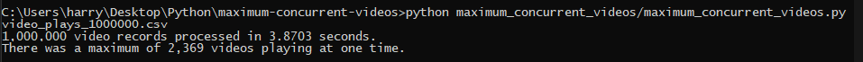
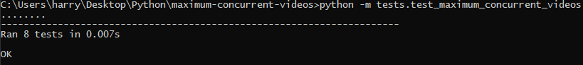

## Given information about streaming video plays, find the maximum number of video plays that were playing concurrently.   

Write Scala, Java or Python code that accepts a finite collection of video play records and returns the maximum that were playing at once.

You can assume:
all end times are after their corresponding start time
each play lasts at most a few hours
all of the plays happen within one calendar month

The following pseudocode describes some criteria to get you started.
```
VideoPlay
    startTime : an instant in time
    endTime   : an instant in time
```
Please present your solution as you would a production piece of code.


## Solution

Code solution can be found in the `maximum_concurrent_videos` folder.

### Running code

```
python maximum_concurrent_videos.py file_name
```

Running code using the `video_plays_1000000.csv` file:



### Assumptions

I made some assumptions for the task:

- Start and end times are in [Epoch time](https://en.wikipedia.org/wiki/Unix_time). 
- Data is stored in a csv file - in reality I'm guessing this would be a database or something similar.
- Videos that start on the exact second that another video ends counts as a concurrent video play.

### Method

- Load data from csv file
- Label start and end times with "start" and "end" respectively
- Sort times in ascending order, making sure start times appear in list before end times to account for videos which start and end at the same point in time
- Loop through sorted times, if a time is marked as "start" then add 1 to the counter, if "end" then subtract 1 from the counter. 
- Whilst looping through sorted times, check to see if current counter value is the maximum value. Set maximum value to counter value if it is higher than the current counter value.
- Return maximum value


## Tests

Running tests:

